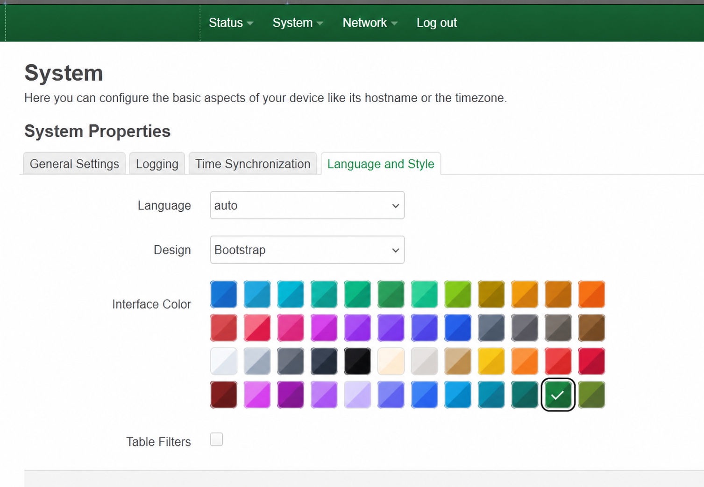

# luci-color-patch selfrestore

OpenWrt feed package for the local LuCI Bootstrap accent color patch.
This branch builds the **selfrestore** variant.

The package is intended for setups with many OpenWrt installations: assign a
different LuCI accent color to each router to make browser tabs and admin
sessions easier to tell apart.



## Variants

Both variants use the same runtime patch and the same `luci.main.accent` UCI
setting. Install only one variant at a time.

| Variant | Branch | Release asset | Sysupgrade behavior |
| --- | --- | --- | --- |
| `selfrestore` | `main` | `luci-color-patch-selfrestore-1.2.2-r4-openwrt-25.12-noarch.apk` | Preserves a cached APK and reinstalls itself on first boot after sysupgrade. |
| `plain` | `no-sysupgrade-restore` | `luci-color-patch-plain-1.2.2-r4-openwrt-25.12-noarch.apk` | Does not preserve or reinstall itself; reinstall manually or include it in the image. |

The package installs an idempotent runtime patcher, a `uci-defaults` hook, an
init script and a preserved local APK cache. It replaces the LuCI Bootstrap
accent dropdown with a compact color palette while keeping the same
`luci.main.accent` UCI option. A manually installed package can therefore
re-install itself after sysupgrade and still show up as installed in the
OpenWrt 25.x `apk` database.

The repository also carries a build-time helper that patches LuCI feed sources
before image generation, which makes the generated sysupgrade image contain the
patched LuCI files immediately.

## Supported Platforms

The package is `PKGARCH:=all` and the generated APK metadata is `arch:noarch`.
One APK is therefore used for the main OpenWrt 25.x targets, including x86/64,
ramips/mt7621, mediatek/filogic, ath79/generic, ipq40xx/generic, ipq806x,
ipq807x, mvebu, rockchip/armv8 and bcm27xx. The target system still needs the
matching LuCI packages from its own OpenWrt repositories.
Tested on OpenWrt 25.12.2 through 25.12.5.

## Accent Values

The UCI setting remains `luci.main.accent`, so existing configs keep working.
Legacy values are still accepted:

```text
blue sky green red yellow orange
```

The palette currently exposes 48 values:

```text
blue sky cyan teal emerald green mint lime yellow amber orange coral red rose pink fuchsia purple violet indigo navy slate zinc stone brown white silver gray charcoal black cream sand tan gold tangerine scarlet crimson maroon orchid plum mauve lavender periwinkle cobalt azure ocean petrol forest olive
```

## Runtime APK Install

Install an unsigned local build with:

```sh
apk add --allow-untrusted --force-overwrite --force-reinstall \
  ./luci-color-patch-selfrestore-1.2.2-r4-openwrt-25.12-noarch.apk
```

The package post-install script enables `/etc/init.d/luci-color-patch`, refreshes
the embedded self-reinstall APK cache at
`/etc/luci-color-patch/luci-color-patch.apk` and applies the LuCI patch.

Check the install state with:

```sh
apk info -e luci-color-patch
test -f /etc/luci-color-patch/luci-color-patch.apk && echo cache-ok
```

After sysupgrade, `/lib/upgrade/keep.d/luci-color-patch` preserves the cached
APK and the small restore scripts. On the first boot, the init script runs:

```sh
/usr/libexec/luci-color-patch/reinstall
```

If the package is missing from the new `apk` database, the restore script uses:

```sh
apk add --allow-untrusted --force-overwrite /etc/luci-color-patch/luci-color-patch.apk
```

This intentionally bypasses package signing for the preserved local APK and
allows overwriting the package's own restored files.

## Attended Sysupgrade

This package is not part of the official OpenWrt package repositories and is
unlikely to be accepted upstream in this form. When using LuCI Attended
Sysupgrade, deselect or disable `luci-color-patch` in the requested package
list before starting the upgrade. The selfrestore variant preserves its local
APK cache and reinstalls the package on first boot after sysupgrade.

## OpenWrt Feed

For GitHub-backed builds:

```sh
src-git -b main lucicolor https://github.com/woffko/luci-color-theme-patch.git
```

For local development:

```sh
src-link lucicolor /home/w0w/luci-color-patch
```

Then run:

```sh
./scripts/feeds update lucicolor
./scripts/feeds install -a -p lucicolor
./feeds/lucicolor/scripts/apply-openwrt-tree.sh
```

Enable `PACKAGE_luci-color-patch=y` in `.config` and rebuild LuCI/image
artifacts.
